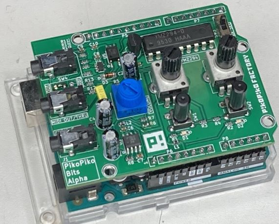

# PikoPikoBitsAlpha
- YMZ294 Chip Tune Synthesizer Shield for Arduino
- Piko Piko Bits Alpha は Arduino用 Chip Tuneシールド です。
- PSG音源YMZ294、MIDI in/out搭載。Arduinoがシンセになります。

## ハードウェア
- Arduno用シールドです。IOはほぼ使い切っています。A4,A5はDigitalOutとして使っていますが、I2Cとして拡張された側（回路図中P5）に接続されているために、Arduino Duemilanove 328のような古いArduinoでは使用できません。
- 電源はUSB給電でも動作しますがノイズが乗りますので、ArduinoのDC電源ジャックに給電して使用することをおすすめします。
- MIDI in/outはTRS規格です。
- MIDI outのU4 NJU7109付近は部品は実装していません。SW4も未実装です。これは当初MIDI THRUを想定して作ったのですが、現状のArduino MIDI Libraryではデフォルトの設定で、MIDI outよりTHRU信号が出力されるので、不要と判断しています。
- オーディオ出力はLM4881を使っていますので、ヘッドフォンは小型のスピーカを直結できます。スピーカーの場合は音が小さいので動作確認用程度に持っていただければと思います。回路図ではLM4880と記載ありますが、LM4880またはLM4881を使用しています。
- SW3はMIDI inをRXから切り離します。つながったままですと、UARTと干渉して、プログラムが正常に書き込めないので、PROG側にしてください。演奏時はMIDI側にしてください。
- 拡張用に、ボリューム×2、LED×2、プッシュSWx2を搭載しています。プログラム次第で自由にお使いいただけます。サンプルコードでの機能は以下のサンプルコードの所で解説します。
   
## ソフトウェア
- Arduino IDEベースです。
- MIDIライブラリが必要です。MIDIライブラリは多種リリースされていますが、https://github.com/FortySevenEffects/arduino_midi_library を使用しています。
## サンプルコード
- Arduino UNO用です。
- MIDI入力されたMIDI信号に合わせて演奏します。MIDIチャンネルは10ch以外の1-16chのすべてのチャンネルを受信します。YMZ294は同時発音数は3音なので、先着3音まで発音し、note offメッセージを受信して、空きができたら、次に来たnote on信号を発音します。試してみるとわかりますが、普通のGM音源用のデータを食わせてもそれなりに聞けてしまいます。（もちろん変なところはありますが）
##### スイッチの機能
- SW1：MIDIパニック。note onのままで、note offが来ないとき（演奏中にMIDIケーブルを引き抜いてしまった等）、発音しっぱなしになりますが、このスイッチを押すと、すべての発音停止します。
- SW2:リズム切り替え。押すとch10を受信してドラム音でリズムを演奏します。現在はバスドラム、スネアドラム、オープンハイハット、クローズハイハット、Hタム、Mタム、Lタムのみです。
##### LEDの機能
- LED1：発音時に点灯します。
- LED2：SW2でリズム時に切り替え時に点灯します。
##### VRの機能
- サンプルコードでは使用していません。
   
   
